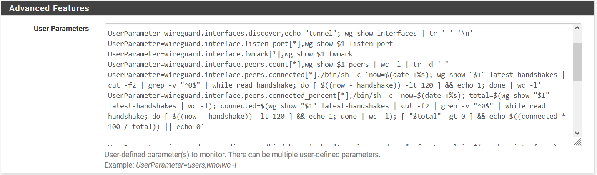
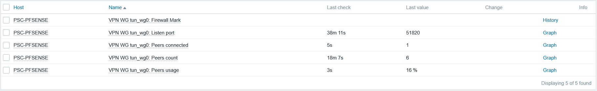
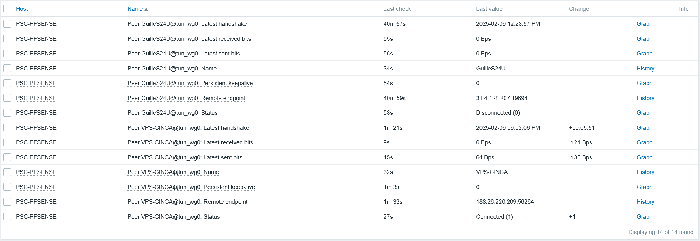
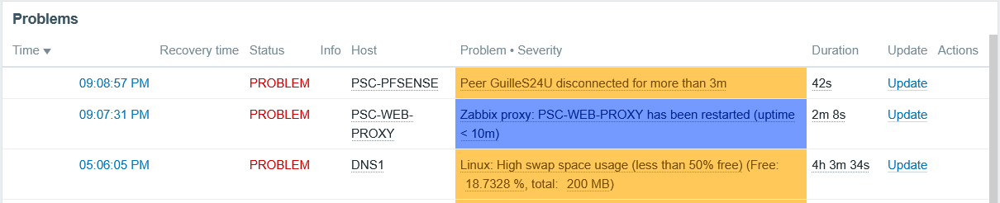

# Zabbix template for Wireguard on pfSense

A template for monitoring Wireguard on pfSense.

## UserParameter (zabbix agent)

Before install template, add this UserParameter to Zabbix Agent configuration on pfSense



```
UserParameter=wireguard.interfaces.discover,echo "tunnel"; wg show interfaces | tr ' ' '\n'
UserParameter=wireguard.interface.listen-port[*],wg show $1 listen-port
UserParameter=wireguard.interface.fwmark[*],wg show $1 fwmark
UserParameter=wireguard.interface.peers.count[*],wg show $1 peers | wc -l | tr -d ' '
UserParameter=wireguard.interface.peers.connected[*],/bin/sh -c 'now=$(date +%s); wg show "$1" latest-handshakes | cut -f2 | grep -v "^0$" | while read handshake; do [ $((now - handshake)) -lt 120 ] && echo 1; done | wc -l'
UserParameter=wireguard.interface.peers.connected_percent[*],/bin/sh -c 'now=$(date +%s); total=$(wg show "$1" latest-handshakes | wc -l); connected=$(wg show "$1" latest-handshakes | cut -f2 | grep -v "^0$" | while read handshake; do [ $((now - handshake)) -lt 120 ] && echo 1; done | wc -l); [ "$total" -gt 0 ] && echo $((connected * 100 / total)) || echo 0'

UserParameter=wireguard.peers.discover,/bin/sh -c 'echo "tunnel;peer;descr"; for tunnel in $(wg show interfaces); do for peer in $(wg show "$tunnel" peers); do descr=$(grep -A 5 -B 5 "$peer" /cf/conf/config.xml | grep "<descr>" | sed -n "s/.*<descr><!\[CDATA\[\(.*\)\]\]><\/descr>.*/\1/p"); echo "$tunnel;$peer;${descr:-none}"; done; done'
UserParameter=wireguard.peer.description[*],/bin/sh -c 'grep -A 5 -B 5 "$2" /cf/conf/config.xml | grep "<descr>" | sed -n "s/.*<descr><!\[CDATA\[\(.*\)\]\]><\/descr>.*/\1/p"'
UserParameter=wireguard.peer.endpoint[*],wg show "$1" endpoints | grep "$2" | cut -f2
UserParameter=wireguard.peer.isconnected[*],/bin/sh -c 'now=$(date +%s); handshake=$(wg show "$1" latest-handshakes | grep "$2" | cut -f2); [ "$handshake" != "0" ] && [ $((now - handshake)) -lt 120 ] && echo 1 || echo 0'
UserParameter=wireguard.peer.latest-handshake[*],wg show "$1" latest-handshakes | grep "$2" | cut -f2
UserParameter=wireguard.peer.transfer.sent[*],wg show "$1" transfer | grep "$2" | cut -f2
UserParameter=wireguard.peer.transfer.received[*],wg show "$1" transfer | grep "$2" | cut -f3
UserParameter=wireguard.peer.persistent-keepalive[*],wg show "$1" persistent-keepalive | grep "$2" | cut -f2
```

## Template 

### Macros

|Macro|Description|Default|Example|
|-|-|-|-|
|{$PFSENSE.WG.PEERS.WARN_IF_DC}|Peers list separated by `\|` to fire a trigger if disconnected.|`Peer1\|Peer2`|`Node1`<br>`Node1\|Node2`|

### Tunnels discovery rule

A discovery rule to detect all tunnels created on the pfSense Wireguard

#### Item Prototypes

|Item Prototype|Description|
|-|-|
|VPN WG {#PFSENSE.WG.IFACE.TUNNEL}: Firewall Mark|Firewall mark value|
|VPN WG {#PFSENSE.WG.IFACE.TUNNEL}: Listen port|Wireguard tunnel listen port|
|VPN WG {#PFSENSE.WG.IFACE.TUNNEL}: Peers connected|Number of peers connected|
|VPN WG {#PFSENSE.WG.IFACE.TUNNEL}: Peers count|Number of peers created on the Wireguard tunnel|
|VPN WG {#PFSENSE.WG.IFACE.TUNNEL}: Peers usage|% of peers connected over created (total)|



### Peers discovery rule

A discovery rule to detect peers created on each tunnel on pfSense Wireguard

#### Item Prototypes

|Item Prototype|Description|
|-|-|
|Peer {#PFSENSE.WG.PEER.DESCR}@{#PFSENSE.WG.PEER.TUNNEL}: Name|Description/Name of the peer (as seen in pfsense wireguard status section|
|Peer {#PFSENSE.WG.PEER.DESCR}@{#PFSENSE.WG.PEER.TUNNEL}: Bits received|Received bits by this client|
|Peer {#PFSENSE.WG.PEER.DESCR}@{#PFSENSE.WG.PEER.TUNNEL}: Bits sent|Sent bits to this client|
|Peer {#PFSENSE.WG.PEER.DESCR}@{#PFSENSE.WG.PEER.TUNNEL}: Latest handshake|Timestamp of latest handshake|
|Peer {#PFSENSE.WG.PEER.DESCR}@{#PFSENSE.WG.PEER.TUNNEL}: Persistent keepalive|Persistent keepalive (configured on pfSense!)|
|Peer {#PFSENSE.WG.PEER.DESCR}@{#PFSENSE.WG.PEER.TUNNEL}: Remote endpoint|Remote IP address and port of the peer|
|Peer {#PFSENSE.WG.PEER.DESCR}@{#PFSENSE.WG.PEER.TUNNEL}: Status|Is connected if the last handshake was within two minutes|



#### Trigger Prototypes

|Trigger Prototype|Description|
|-|-|
|Peer {#PFSENSE.WG.PEER.DESCR} disconnected for more than 3m|Checks if a peer has been disconnected for the last 3 minutes and if its description matches a defined pattern in the macro `{$PFSENSE.WG.PEERS.WARN_IF_DC}`|

